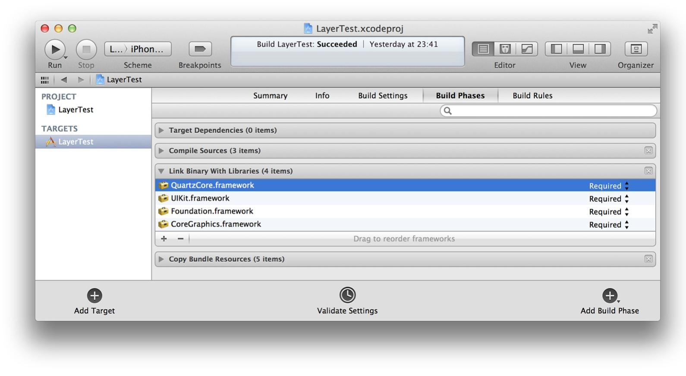
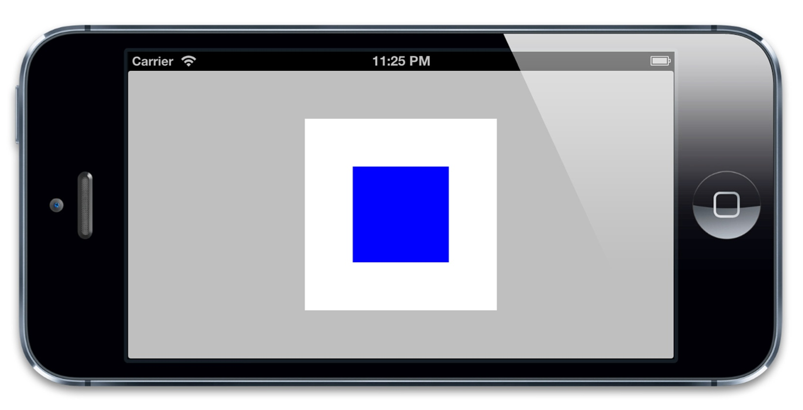

# 1. 图层树

> 巨妖有图层，洋葱也有图层，你懂吗？我们都有图层 -- 史莱克

Core Animation其实是一个令人误解的命名。你可能认为它只是用来做动画的，但实际上它是从一个叫做_Layer Kit_这么一个不怎么和动画有关的名字演变而来，所以做动画这只是Core Animation特性的冰山一角。

Core Animation是一个_复合引擎_，它的职责就是尽可能快地组合屏幕上不同的可视内容，这个内容是被分解成独立的_图层_，存储在一个叫做_图层树_的体系之中。于是这个树形成了**UIKit**以及在iOS应用程序当中你所能在屏幕上看见的一切的基础。

在我们讨论动画之前，我们将从图层树开始，涉及一下Core Animation的_静态_组合以及布局特性。

## 图层和视图

如果你曾经在iOS或者Mac OS平台上写过应用程序，你可能会对_视图_的概念比较熟悉。一个视图就是在屏幕上显示的一个矩形块（比如图片，文字或者视频），它能够拦截类似于鼠标点击或者触摸手势等用户输入。视图在层级关系中可以互相嵌套，一个视图可以管理它的所有子视图的位置。图1.1显示了一种典型的视图层级关系


在iOS当中，所有的视图都从一个叫做`UIVIew`的基类派生而来，`UIView`可以处理触摸事件，可以支持基于_Core Graphics_绘图，可以做仿射变换（例如旋转或者缩放），或者简单的类似于滑动或者渐变的动画。

### CALayer

`CALayer`类在概念上和`UIView`类似，同样也是一些被层级关系树管理的矩形块，同样也可以包含一些内容（像图片，文本或者背景色），管理子图层的位置。它们有一些方法和属性用来做动画和变换。和`UIView`最大的不同是`CALayer`不处理用户的交互。

`CALayer`并不清楚具体的_响应链_（iOS通过视图层级关系用来传送触摸事件的机制），于是它并不能够响应事件，即使它提供了一些方法来判断是否一个触点在图层的范围之内（具体见第三章，“图层的几何学”）

### 平行的层级关系

每一个`UIview`都有一个`CALayer`实例的图层属性，也就是所谓的_backing layer_，视图的职责就是创建并管理这个图层，以确保当子视图在层级关系中添加或者被移除的时候，他们关联的图层也同样对应在层级关系树当中有相同的操作（见图1.2）。


实际上这些背后关联的图层才是真正用来在屏幕上显示和做动画，`UIView`仅仅是对它的一个封装，提供了一些iOS类似于处理触摸的具体功能，以及Core Animation底层方法的高级接口。

但是为什么iOS要基于`UIView`和`CALayer`提供两个平行的层级关系呢？为什么不用一个简单的层级来处理所有事情呢？原因在于要做职责分离，这样也能避免很多重复代码。在iOS和Mac OS两个平台上，事件和用户交互有很多地方的不同，基于多点触控的用户界面和基于鼠标键盘有着本质的区别，这就是为什么iOS有UIKit和`UIView`，但是Mac OS有AppKit和`NSView`的原因。他们功能上很相似，但是在实现上有着显著的区别。

绘图，布局和动画，相比之下就是类似Mac笔记本和桌面系列一样应用于iPhone和iPad触屏的概念。把这种功能的逻辑分开并应用到独立的Core Animation框架，苹果就能够在iOS和Mac OS之间共享代码，使得对苹果自己的OS开发团队和第三方开发者去开发两个平台的应用更加便捷。

实际上，这里并不是两个层级关系，而是四个，每一个都扮演不同的角色，除了视图层级和图层树之外，还存在_呈现树_和_渲染树_，将在第七章“隐式动画”和第十二章“性能调优”分别讨论。

## 图层的能力

如果说`CALayer`是`UIView`内部实现细节，那我们为什么要全面地了解它呢？苹果当然为我们提供了优美简洁的`UIView`接口，那么我们是否就没必要直接去处理Core Animation的细节了呢？

某种意义上说的确是这样，对一些简单的需求来说，我们确实没必要处理`CALayer`，因为苹果已经通过`UIView`的高级API间接地使得动画变得很简单。

但是这种简单会不可避免地带来一些灵活上的缺陷。如果你略微想在底层做一些改变，或者使用一些苹果没有在`UIView`上实现的接口功能，这时除了介入Core Animation底层之外别无选择。

我们已经证实了图层不能像视图那样处理触摸事件，那么他能做哪些视图不能做的呢？这里有一些`UIView`没有暴露出来的CALayer的功能：

* 阴影，圆角，带颜色的边框
* 3D变换
* 非矩形范围
* 透明遮罩
* 多级非线性动画

我们将会在后续章节中探索这些功能，首先我们要关注一下在应用程序当中`CALayer`是怎样被利用起来的。

## 使用图层

首先我们来创建一个简单的项目，来操纵一些`layer`的属性。打开Xcode，使用_Single View Application_模板创建一个工程。

在屏幕中央创建一个小视图（大约200 X 200的尺寸），当然你可以手工编码，或者使用Interface Builder（随你方便）。确保你的视图控制器要添加一个视图的属性以便可以直接访问它。我们把它称作`layerView`。

运行项目，应该能在浅灰色屏幕背景中看见一个白色方块（图1.3），如果没看见，可能需要调整一下背景window或者view的颜色


这并没有什么令人激动的地方，我们来添加一个色块，在白色方块中间添加一个小的蓝色块。

我们当然可以简单地在已经存在的`UIView`上添加一个子视图（随意用代码或者IB），但这不能真正学到任何关于图层的东西。

于是我们来创建一个`CALayer`，并且把它作为我们视图相关图层的子图层。尽管`UIView`类的接口中暴露了图层属性，但是标准的Xcode项目模板并没有包含Core Animation相关头文件。所以如果我们不给项目添加合适的库，是不能够使用任何图层相关的方法或者访问它的属性。所以首先需要添加QuartzCore框架到Build Phases标签（图1.4），然后在vc的.m文件中引入库。



之后就可以在代码中直接引用`CALayer`的属性和方法。在清单1.1中，我们用创建了一个`CALayer`，设置了它的`backgroundColor`属性，然后添加到`layerView`背后相关图层的子图层（这段代码的前提是通过IB创建了`layerView`并做好了连接），图1.5显示了结果。

清单1.1 给视图添加一个蓝色子图层

```text
#import "ViewController.h"
#import <QuartzCore/QuartzCore.h>
@interface ViewController ()

@property (nonatomic, weak) IBOutlet UIView *layerView;

@end

@implementation ViewController

- (void)viewDidLoad
{
    [super viewDidLoad];
    //create sublayer
    CALayer *blueLayer = [CALayer layer];
    blueLayer.frame = CGRectMake(50.0f, 50.0f, 100.0f, 100.0f);
    blueLayer.backgroundColor = [UIColor blueColor].CGColor;
    //add it to our view
    [self.layerView.layer addSublayer:blueLayer];
}
@end
```



一个视图只有一个相关联的图层（自动创建），同时它也可以支持添加无数多个子图层，从清单1.1可以看出，你可以显示创建一个单独的图层，并且把它直接添加到视图关联图层的子图层。尽管可以这样添加图层，但往往我们只是见简单地处理视图，他们关联的图层并不需要额外地手动添加子图层。

在Mac OS平台，10.8版本之前，一个显著的性能缺陷就是由于用了视图层级而不是单独在一个视图内使用`CALayer`树状层级。但是在iOS平台，使用轻量级的`UIView`类并没有显著的性能影响（当然在Mac OS 10.8之后，`NSView`的性能同样也得到很大程度的提高）。

使用图层关联的视图而不是`CALayer`的好处在于，你能在使用所有`CALayer`底层特性的同时，也可以使用`UIView`的高级API（比如自动排版，布局和事件处理）。

然而，当满足以下条件的时候，你可能更需要使用`CALayer`而不是`UIView`

* 开发同时可以在Mac OS上运行的跨平台应用
* 使用多种`CALayer`的子类（见第六章，“特殊的图层“），并且不想创建额外的`UIView`去包封装它们所有
* 做一些对性能特别挑剔的工作，比如对`UIView`一些可忽略不计的操作都会引起显著的不同（尽管在这种情况下，你可能会想直接使用OpenGL来绘图）

但是这些例子都很少见，总的来说，处理视图会比单独处理图层更加方便。

## 总结

这一章阐述了图层的树状结构，说明了如何在iOS中由`UIView`的层级关系形成的一种平行的`CALayer`层级关系，在后面的实验中，我们创建了自己的`CALayer`，并把它添加到图层树中。

在第二章，“图层关联的图片”，我们将要研究一下`CALayer`关联的图片，以及Core Animation提供的操作显示的一些特性。

